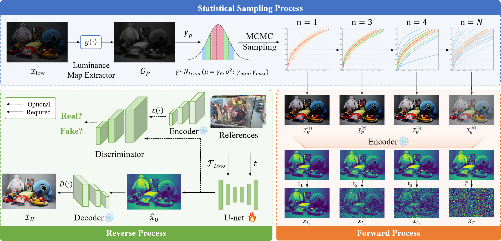

# 🚀 LASQ: Unsupervised Hierarchical Learning for Illumination Enhancement

---

## 🏗️ 1. Introduction

LASQ reformulates low-light image enhancement as a statistical sampling process over hierarchical luminance distributions, leveraging a diffusion-based forward process to autonomously model luminance transitions and achieve unsupervised, generalizable light restoration across diverse illumination conditions.
The overall architecture is illustrated below 👇  

<p align="center">
  
</p>

---
## 📦 2. Create Environment

```bash
# Environment setup
conda create -n LSAQ python=3.11
conda activate LASQ

# Install dependencies
pip install -r requirements.txt
```
---
## 📂 3. Data Preparation

### 3.1 💾 Data Preparation  
LOLv1 dataset: Chen Wei, Wenjing Wang, Wenhan Yang, and Jiaying Liu. "Deep Retinex Decomposition for Low-Light Enhancement". BMVC, 2018. [🌐Google Drive](https://drive.google.com/file/d/18bs_mAREhLipaM2qvhxs7u7ff2VSHet2/view)

LSRW dataset: Jiang Hai, Zhu Xuan, Ren Yang, Yutong Hao, Fengzhu Zou, Fang Lin, and Songchen Han. "R2RNet: Low-light Image Enhancement via Real-low to Real-normal Network". Journal of Visual Communication and Image Representation, 2023. [🌐Baiduyun (extracted code: wmrr)](https://pan.baidu.com/s/1XHWQAS0ZNrnCyZ-bq7MKvA)

Test datesets without GT: [🌐Google Drive](https://drive.google.com/file/d/1W8YhjEdc_v52y4kB8aEMzv16ngL8pzNL/view?usp=sharing)


Challenging Scenes: [🌐Google Drive](https://drive.google.com/file/d/1lg5q2sYTPJ72uVLBGlJGw3M8wK_OY-Ox/view?usp=sharing)

### 3.2 🗂️ Datasets Organization
Load backbone and fusion modules.  
Initialize with pre-trained weights if available.  
