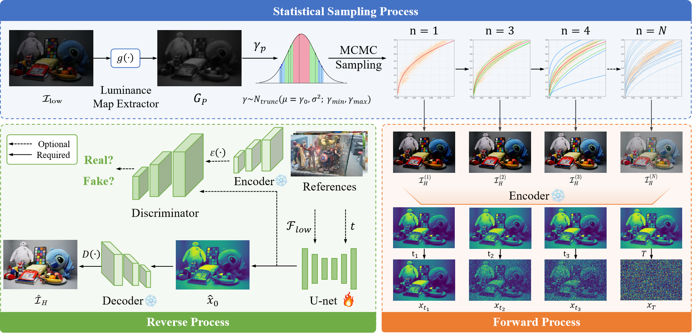
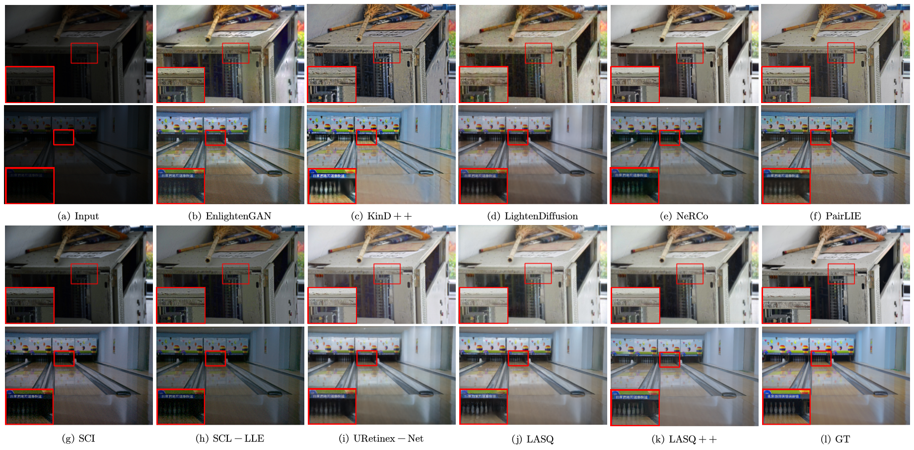

# 🚀 LASQ: Unsupervised Hierarchical Learning for Illumination Enhancement

---

## 🏗️ 1. Introduction

LASQ reformulates low-light image enhancement as a statistical sampling process over hierarchical luminance distributions, leveraging a diffusion-based forward process to autonomously model luminance transitions and achieve unsupervised, generalizable light restoration across diverse illumination conditions.
The overall architecture is illustrated below 👇  

<p align="center">
  
</p>

---
## 📦 2. Create Environment

```bash
# Environment setup
conda create -n LSAQ python=3.11
conda activate LASQ

# Install dependencies
pip install -r requirements.txt
```
---
## 📂 3. Data Preparation

### 3.1 💾 Data Preparation  
LOLv1 dataset: Chen Wei, Wenjing Wang, Wenhan Yang, and Jiaying Liu. "Deep Retinex Decomposition for Low-Light Enhancement". BMVC, 2018. [🌐Google Drive](https://drive.google.com/file/d/18bs_mAREhLipaM2qvhxs7u7ff2VSHet2/view)

LSRW dataset: Jiang Hai, Zhu Xuan, Ren Yang, Yutong Hao, Fengzhu Zou, Fang Lin, and Songchen Han. "R2RNet: Low-light Image Enhancement via Real-low to Real-normal Network". Journal of Visual Communication and Image Representation, 2023. [🌐Baiduyun (extracted code: wmrr)](https://pan.baidu.com/s/1XHWQAS0ZNrnCyZ-bq7MKvA)

Test datesets without GT: [🌐Google Drive](https://drive.google.com/file/d/1W8YhjEdc_v52y4kB8aEMzv16ngL8pzNL/view?usp=sharing)


Challenging Scenes: [🌐Google Drive](https://drive.google.com/file/d/1lg5q2sYTPJ72uVLBGlJGw3M8wK_OY-Ox/view?usp=sharing)

### 3.2 🗂️ Datasets Organization
We provide a script `TXT_Generation.py` to automatically generate dataset path files that are compatible with our code. Please place the generated files according to the directory structure shown below 👇
```
data/
 ├── Image_restoration/
 │    └── LOL-v1/
 │        ├── LOLv1_val.txt
 │        └── unpaired_train.txt
```
## 🧩 4. Pre-trained Models
You can download our pre-trained model from [🌐Google Drive](https://drive.google.com/file/d/1ng1hKxBaMBBG6GfRRnlcSXjIeLA6L9VD/view?usp=sharing) and place them according to the following directory structure 👇
> **🌟 Update:** In response to user requests, we have also provided supplementary pre-trained weights for **LOLv2**. You can download them from [🌐Google Drive](https://drive.google.com/file/d/1xO44cCkSuJMyefRl34PoPJZl_HOuLaaR/view?usp=drive_link).
```
ckpt/
 ├── stage1/
 │    └── stage1_weight.pth.tar
 └── stage2/
      └── stage2_weight.pth.tar
```
##  🧪 5. Testing
```bash
python3 evaluate.py

```

##  🔬 6. Training
```bash
CUDA_VISIBLE_DEVICES=0,1,2,3 torchrun --nproc_per_node=4 train.py

```

##  🖼️ 7. Visual Comparison

<p align="center">
  
</p>

<p align="center">
  
</p>


##  📚 8. Citation
If you use this code or ideas from the paper for your research, please cite our paper:

```bash
@article{kong2026luminance,
  title={Luminance-Aware Statistical Quantization: Unsupervised Hierarchical Learning for Illumination Enhancement},
  author={Kong, Derong and Yang, Zhixiong and Li, Shengxi and Zhi, Shuaifeng and Liu, Li and Liu, Zhen and Xia, Jingyuan},
  journal={Advances in Neural Information Processing Systems},
  volume={38},
  pages={116286--116313},
  year={2026}
}
```

##  🙏 9. Acknowledgement

The codes are based on [LightenDiffusion](https://github.com/JianghaiSCU/LightenDiffusion). Please also cite their paper. We thank all the authors for their contributions.


